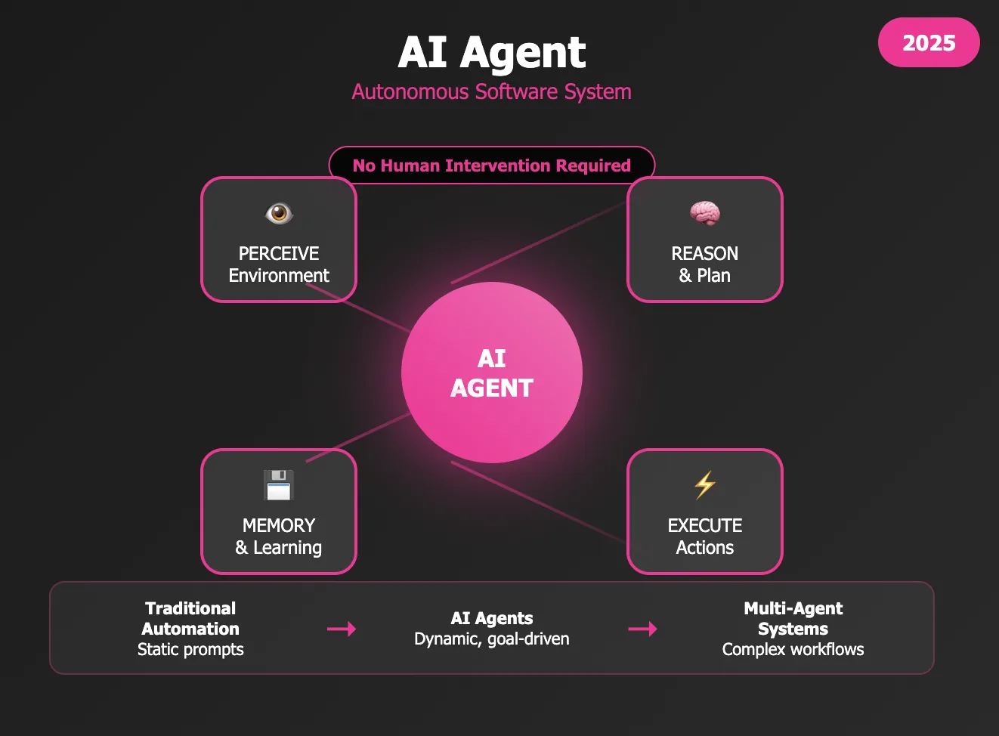

# Agent Framework Architectures
## Overview
AI agent frameworks provide structured approaches to building systems where large language models (LLMs) not only generate text but actively reason, plan, and execute actions across tools, APIs, and other agents. The field has matured rapidly, converging around a set of well-defined architectural patterns that can be combined, layered, and specialized depending on task complexity. Understanding these patterns — from the simplest single-agent loops to hierarchical multi-agent systems — is essential for architects and engineers building production-grade agentic applications in 2026.[^1][^2]

***
## Core Components of an Agent

AI Agent Diagram
Every agent architecture, regardless of complexity, is built from the same fundamental components:[^1]
- **LLM (Reasoning Engine):** The "brain" that processes context, decides on actions, and generates outputs
- **Tool Definitions:** Callable functions, APIs, code interpreters, or search systems the agent can invoke
- **Memory System:** Storage for conversation history, intermediate results, and long-term knowledge
- **Control Flow Logic:** The decision-making loop that governs how the agent selects and sequences actions
- **Execution Environment:** The runtime that calls tools and returns observations to the agent

These components are assembled differently depending on the chosen architectural pattern.

***
## Single-Agent Architectures
### ReAct (Reason + Act)
ReAct is the most foundational agentic pattern and the appropriate default starting point for most tasks. It interleaves reasoning and action in a continuous feedback loop structured as three repeating phases:[^3]

1. **Thought** — The agent reasons about what to do next
2. **Action** — The agent invokes a tool, API, or code execution
3. **Observation** — The agent processes the result and updates its plan

This cycle continues until the task is complete or a maximum iteration limit is reached. ReAct is the most expensive pattern per task because every reasoning step is a full LLM call; a six-step loop on GPT-4o can cost $0.15 per run, making iteration limits critical for cost control at scale.[^4]
### Plan-and-Execute
For tasks requiring long-horizon reasoning, Plan-and-Execute separates planning from action. A dedicated planner produces an explicit multi-step plan upfront, then an executor works through each step sequentially. After each step, the system can optionally re-plan based on new information. This prevents the "goal drift" common in pure ReAct agents on complex tasks, where the original objective can get lost in iterative reasoning.[^5][^6]
### Reflection and Reflexion
The **Reflection** pattern adds a self-critique loop: the agent generates an initial output, evaluates it against defined criteria, and iteratively revises until the output meets a quality threshold. **Reflexion** extends this by persisting memory across multiple trials — each failed attempt updates a memory store with insights that guide subsequent attempts, enabling genuine learning from failure. Reflexion is best suited for optimization tasks and complex problem-solving where iterative refinement toward an optimal solution is valued over speed.[^4][^7]
### LATS (Language Agent Tree Search)
LATS represents the most sophisticated single-agent pattern, combining Monte Carlo Tree Search (MCTS) with LLM reflection. Rather than committing to a single reasoning chain, LATS explores multiple solution paths in parallel, using a **UCB (Upper Confidence Bound) formula** to balance exploitation of high-value nodes with exploration of less-visited paths. Its four main steps are:[^8][^9][^10]

1. **Select** — Pick the most promising node using UCB scoring
2. **Expand and Simulate** — Generate and execute the best 5 candidate actions in parallel
3. **Reflect + Evaluate** — Score each path using LLM self-reflection
4. **Backpropagate** — Update value estimates across the tree based on outcomes

LATS outperforms ReAct and Reflexion on complex reasoning benchmarks but is very high in cost and latency, making it unsuitable for time-sensitive or cost-sensitive applications.[^9][^8]

***
## Multi-Agent Architectures
As task complexity grows, single-agent prompts become overloaded with tool definitions and conflicting instructions. Multi-Agent Systems (MAS) solve this by distributing work across specialized agents — an approach analogous to microservices in software architecture.[^11][^12][^5]
### Orchestrator-Worker (Hierarchical Supervisor)
The most stable and widely-deployed multi-agent pattern, Hierarchical Supervision organizes agents into a clear command structure:[^12][^5]

- **The Orchestrator/Supervisor:** A routing agent (with no external tools of its own) that analyzes requests and delegates to workers
- **Worker Agents:** Specialized agents (e.g., "Coder," "Web Researcher," "Data Analyst") with restricted toolsets and domain focus
- **Handoff Protocol:** Workers execute their subtask and return a structured result to the supervisor, which synthesizes outputs and dispatches refined tasks to subsequent workers

This pattern enables predictable, debuggable behavior — every action traces back to a central decision-maker — and scales well via map-reduce decomposition. Layered implementations (Mixture of Agents, or MoA) allow progressive task improvement across multiple orchestration tiers.[^13][^12]
### Hierarchical Task Decomposition
An advanced implementation of the coordinator pattern, this architecture allows a root agent to decompose a complex task through multiple levels, with each level recursively delegating until subtasks are simple enough for a leaf-level worker to execute directly. This is suited for research, planning, and analysis tasks requiring extensive multi-phase planning.[^14]
### Swarm Pattern
In the swarm pattern, a dispatcher routes a user request to a collaborative group of specialized agents. Unlike the strict hierarchical pattern, any agent in the swarm can communicate with any other agent, share findings, critique proposals, and hand off to the agent best suited for the next step. This produces emergent, collaborative reasoning but introduces coordination overhead and can be harder to debug.[^14]
### Sequential and Parallel Workflows
Google's Agent Development Kit (ADK) formalizes three foundational execution primitives that underpin most multi-agent systems:[^11]

| Execution Pattern | Description | Best For |
|---|---|---|
| **Sequential** | Agents execute one after another in a defined order | Pipelines with strict dependencies |
| **Parallel** | Multiple agents execute simultaneously | Independent subtasks, data gathering |
| **Loop** | An agent or group repeats until a condition is met | Refinement, validation, ReAct |

Real production systems compose these primitives; for example, a parallel gather phase feeding into a sequential analysis-and-synthesis pipeline.[^4]

***
## Memory Architecture
Memory is a cross-cutting concern that applies to both single- and multi-agent systems. Production agents require three distinct memory types working in concert:[^15]

| Memory Type | What It Stores | Implementation | Example Use |
|---|---|---|---|
| **Episodic** | Specific events, interactions, and their outcomes | Vector databases (semantic retrieval by relevance) | "This user opened three billing tickets last month" [^15][^16] |
| **Semantic** | General knowledge, facts, and learned concepts | Knowledge graphs, vector stores, structured DBs | "Approach X works best when conditions A and B are present" [^15][^17] |
| **Procedural** | Skills, workflows, and execution processes | Prompt templates, code, fine-tuned weights | Following a defined code-review process consistently [^15][^17] |

Short-term (in-context) memory manages the immediate conversation window, while long-term memory persists across sessions. An agent with only one memory type is fundamentally limited: episodic memory alone causes over-personalization; semantic memory alone prevents learning from experience; procedural memory alone produces inflexibility.[^15]

***
## Key Design Patterns Compared
| Pattern | Complexity | LLM Calls per Task | Best For | Key Limitation |
|---|---|---|---|---|
| **ReAct** | Low | Medium (1 per step) | Dynamic, unpredictable tasks | Expensive at scale; circular on weak models [^4] |
| **Plan-and-Execute** | Low-Medium | Low (plan once, execute) | Long-horizon structured tasks | Brittle if initial plan is wrong [^6] |
| **Reflection** | Medium | Medium-High | Output quality improvement | Adds latency, may not converge [^4] |
| **Reflexion** | High | High (multi-trial) | Optimization, learning from failure | Very high cost; needs clear success criteria [^7] |
| **LATS** | Very High | Very High (tree exploration) | Strategic reasoning, complex puzzles | Very expensive; too slow for real-time [^8] |
| **Orchestrator-Worker** | Medium-High | Medium | Complex task decomposition | Coordination overhead; central point of failure [^12][^13] |
| **Swarm** | High | High (inter-agent comms) | Collaborative research and analysis | Hard to debug; emergent and less predictable [^14] |

***
## Human-in-the-Loop (HITL) Architecture
As agents move from suggestions to real-world actions (booking meetings, deploying code, modifying infrastructure), human oversight is a first-class architectural concern, not an afterthought. Modern HITL design involves four layers:[^18][^19][^20]

1. **Intent Layer:** Humans define goals, constraints, and permitted actions upfront
2. **Planning Layer:** The agent produces a plan with reasoning exposed for human review
3. **Approval Gate:** Human approves or revises before high-stakes actions execute
4. **Feedback Loop:** Human corrections update the agent's reasoning, not just its outputs

**Confidence-adaptive escalation** is an emerging best practice: HITL is triggered not just by action type, but by model confidence falling below a threshold, disagreement between agents, or the action's "blast radius" exceeding a defined limit (e.g., affects more than N records or exceeds a financial threshold). Guardrails — input filters, output validators, budget limits, and approval gates — provide the technical controls that complement HITL governance.[^21][^18]

***
## Major Frameworks
The framework landscape has consolidated around several production-ready options:[^22][^23]

| Framework | Orchestration Model | State Management | Best For | 2026 Status |
|---|---|---|---|---|
| **LangGraph** | Graph-based state machines | Native checkpointing | Production systems needing observability and durable execution | Active; used at Klarna, Replit, Elastic [^23] |
| **CrewAI** | Role-based "crews" | Basic (memory add-on) | Fast delivery, content/support pipelines, role-mapped problems | Active; v0.98+; 5.76× faster than LangGraph on some QA tasks [^23] |
| **AutoGen / Microsoft Agent Framework** | Conversational agents | Manual / custom | Research, prototyping, enterprise Azure deployments | AutoGen in maintenance; successor is Microsoft Agent Framework [^23] |
| **Google ADK + Vertex AI** | Sequential/loop/parallel primitives | Managed | Structured engineering, security-sensitive deployments | Active; supports both MCP and A2A [^24] |
| **AWS Bedrock AgentCore** | Managed runtime | Scalable, private | Private, high-scale agent runtimes | Active [^22] |

Debugging and observability differ significantly: LangGraph leads with LangSmith integration providing professional-grade tracing; AutoGen Studio offers visual debugging for conversation flows; CrewAI exposes agent reasoning in logs but without LangGraph's tooling depth.[^23]

***
## Interoperability Protocols
Protocol convergence is the defining architectural trend of 2026, reducing vendor lock-in and enabling hybrid, best-of-breed agent deployments:[^24][^25]

- **MCP (Model Context Protocol):** Anthropic's standard for **vertical tool integration** — how an agent connects to tools, APIs, and data sources. Now the non-negotiable baseline for production systems.[^25][^26]
- **A2A (Agent-to-Agent Protocol):** Google's standard for **horizontal agent coordination** — how multiple agents discover each other, delegate tasks, and exchange results across framework and organizational boundaries. Backed by 100+ enterprises including Salesforce, SAP, PayPal, and ServiceNow.[^27][^26]
- **ACP (Agent Communication Protocol):** IBM's lightweight REST-native protocol, now merged into A2A (late 2025), further consolidating the inter-agent communication layer.[^27]

All three protocols now sit under **Linux Foundation** oversight, with MCP, A2A, and ACP governed by the same institution — the most important structural fact of Q1 2026. The emerging two-layer reference architecture pairs MCP (tool integration) with A2A (agent coordination), and is already implemented by Google ADK, Salesforce Agentforce, and ServiceNow Now Assist.[^25]

***
## Choosing an Architecture
No single architecture is universally optimal. The decision framework follows task characteristics:[^12][^4]

- **Start with ReAct** for any dynamic task with unpredictable tool use patterns
- **Add Plan-and-Execute** when task complexity requires long-horizon coherence beyond what step-by-step ReAct can maintain
- **Layer Reflection or Reflexion** when output quality or iterative improvement matters more than latency
- **Introduce multi-agent patterns** when a single agent's context becomes overloaded or when distinct specializations yield clearer results than a monolithic prompt
- **Add HITL gates** for any action with real-world consequences, irreversibility, or regulatory exposure
- **Implement MCP + A2A** for any production system expected to interoperate with other agents or tools in an evolving ecosystem

Production systems rarely use exactly one pattern. A sophisticated content production agent might combine Tool Use (research APIs) + ReAct (adaptive research loop) + Reflection (draft self-critique) + Orchestrator-Worker (separate writer and editor agents). The guiding principle is to start simple and add patterns only when there is specific evidence that a simpler combination is insufficient.[^4]

---

## References

1. [The ultimate guide to AI agent architectures in 2025 - DEV Community](https://dev.to/sohail-akbar/the-ultimate-guide-to-ai-agent-architectures-in-2025-2j1c) - This comprehensive guide examines the eight major architecture patterns that have emerged as standar...

2. [Agentic AI patterns and workflows on AWS - AWS Prescriptive Guidance](https://docs.aws.amazon.com/prescriptive-guidance/latest/agentic-ai-patterns/introduction.html) - Agentic patterns are reusable frameworks for LLM-based AI agents that solve complex problems across ...

3. [The Roadmap to Mastering Agentic AI Design Patterns](https://machinelearningmastery.com/the-roadmap-to-mastering-agentic-ai-design-patterns/) - In this article, you will learn how to systematically select and apply agentic AI design patterns to...

4. [The 7 Agentic AI Design Patterns Every Developer Should Know ...](https://dev.to/emperorakashi20/the-7-agentic-ai-design-patterns-every-developer-should-know-react-reflection-tool-use-and-more-3bba) - The 4 patterns every production AI agent uses — with real implementation examples in LangGraph and n...

5. [Design Patterns for Agentic AI and Multi-Agent Systems](https://appstekcorp.com/blog/design-patterns-for-agentic-ai-and-multi-agent-systems/) - Explore how agentic AI leverages multi-agent systems and design patterns to enable orchestration log...

6. [Navigating Modern LLM Agent Architectures - Wollen Labs](https://www.wollenlabs.com/blog-posts/navigating-modern-llm-agent-architectures-multi-agents-plan-and-execute-rewoo-tree-of-thoughts-and-react) - In LangGraph, an implementation called Language Agent Tree Search (LATS) combines aspects of ToT wit...

7. [Reflexion Pattern](https://agent-patterns.readthedocs.io/en/latest/patterns/reflexion.html)

8. [LATS Agent Pattern — Agent Patterns 0.2.0 documentation](https://agent-patterns.readthedocs.io/en/stable/patterns/lats.html) - LATS Agent Pattern . The LATS (Language Agent Tree Search) pattern performs Monte Carlo Tree Search-...

9. [Language Agent Tree Search - Build reliable AI systems](https://langchain-ai.github.io/langgraph/tutorials/lats/lats/) - Build reliable, stateful AI systems, without giving up control

10. [language-agent-tree-search-lats.md - GitHub](https://github.com/nibzard/awesome-agentic-patterns/blob/main/patterns/language-agent-tree-search-lats.md) - When to use LATS: Complex reasoning tasks requiring strategic planning and multi-step decision makin...

11. [Google's Eight Essential Multi-Agent Design Patterns - InfoQ](https://www.infoq.com/news/2026/01/multi-agent-design-patterns/) - Multi-Agent Systems (MAS) allow you to build the AI equivalent of a microservices architecture. By a...

12. [Architectures for Multi-Agent Systems - Galileo AI](https://galileo.ai/blog/architectures-for-multi-agent-systems) - There's no universal best architecture. Each pattern creates different emergent behaviors, performan...

13. [AI Agent Architecture Patterns: Single & Multi-Agent Systems - Redis](https://redis.io/blog/ai-agent-architecture-patterns/) - Multi-agent systems often add coordination overhead (more calls, more messages, more state), especia...

14. [Reason and act (ReAct) pattern](https://docs.cloud.google.com/architecture/choose-design-pattern-agentic-ai-system) - Learn how to select an agent design pattern to build your agentic system.

15. [Beyond Short-term Memory: The 3 Types of Long-term Memory AI ...](https://machinelearningmastery.com/beyond-short-term-memory-the-3-types-of-long-term-memory-ai-agents-need/) - Episodic memory allows AI agents to recall specific events and experiences from their operational hi...

16. [AI Agent Memory: Types, Architecture & Implementation - AI Solutions](https://genta.dev/resources/ai-agent-memory-types-architecture-guide) - Episodic memory stores specific past events: what the agent did, what the user said, what outcomes r...

17. [Significance of Procedural, Semantic, and Episodic Memory for LLM ...](https://www.linkedin.com/pulse/significance-procedural-semantic-episodic-memory-llm-hatalis-ph-d--ezate) - Procedural Memory helps the agent consistently execute tasks, use internal reasoning frameworks, and...

18. [Design Patterns For Safe Agentic AI: Guardrails, Policies And ...](https://rahulkolekar.com/design-patterns-for-safe-agentic-ai-guardrails-policies-and-human-approval-flows/) - Human in the loop means people stay involved where judgment and accountability matter: Approving or ...

19. [Human-in-the-Loop: A 2026 Guide to AI Oversight That Actually Works](https://www.strata.io/blog/agentic-identity/practicing-the-human-in-the-loop/) - Human-in-the-loop (HITL) is an AI governance approach where trained humans retain decision authority...

20. [The Missing Guardrail: Why AI Agents Need Human In The Loop ...](https://www.linkedin.com/pulse/missing-guardrail-why-ai-agents-need-human-loop-faisal-feroz-lq1sf) - Human intervention isn't a safety net you add later. It must be part of your core architecture. This...

21. [Human-in-the-Loop: Phase or Permanent Fixture for Agentic AI?](https://regolo.ai/human-in-the-loop-autonomous-ai-agents-governance/) - Research published on arXiv in early 2025 documents three primary failure modes unique to multi-agen...

22. [AI Agent Frameworks: Top 5 Ranked for November 2025](https://alphacorp.ai/blog/top-5-ai-agent-frameworks-november-2025) - AI agent frameworks ranked by verified data across maturity, security and protocols. See why LangGra...

23. [AutoGen vs CrewAI vs LangGraph: AI Framework Comparison 2025](https://jetthoughts.com/blog/autogen-crewai-langgraph-ai-agent-frameworks-2025/) - Three open source agent frameworks compared: LangGraph state machines, CrewAI role-based crews, Auto...

24. [Agent Framework Wars 2025: Your Strategic Guide to Choosing the ...](https://www.linkedin.com/pulse/agent-framework-wars-2025-your-strategic-guide-right-ai-hightower-dwgrc) - It's about strategic positioning, cost structures, and architectural decisions that will ripple thro...

25. [Agent Interoperability Protocols 2026: MCP, A2A, ACP and the Path ...](https://zylos.ai/research/2026-03-26-agent-interoperability-protocols-mcp-a2a-acp-convergence) - A comprehensive analysis of the evolving agent-to-agent communication protocol landscape — comparing...

26. [Open Protocols for Agent Interoperability Part 1 - AWS](https://aws.amazon.com/blogs/opensource/open-protocols-for-agent-interoperability-part-1-inter-agent-communication-on-mcp/) - Multiple protocols have emerged that enable this capability, including the Model Context Protocol (M...

27. [The AI Agent Protocol Wars - MCP vs A2A](https://www.hungyichen.com/en/insights/ai-agent-protocol-wars) - IBM, which had independently developed ACP (Agent Communication Protocol), announced its merger into...
